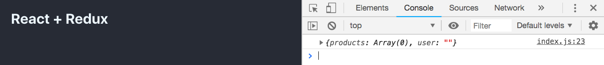
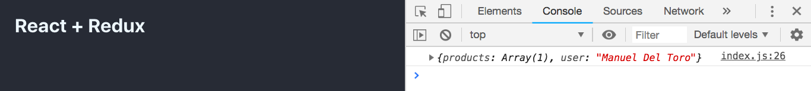
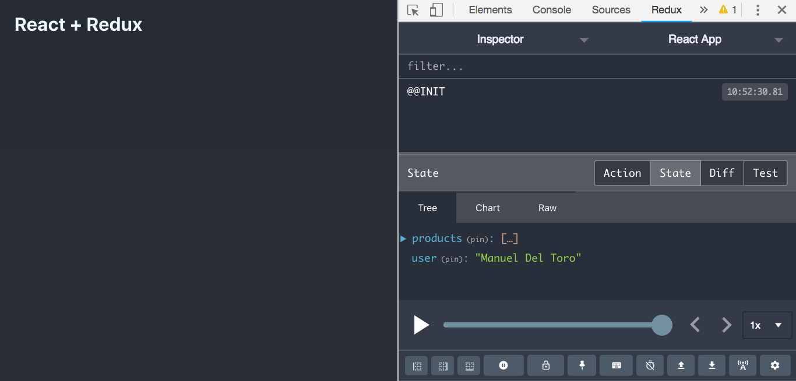
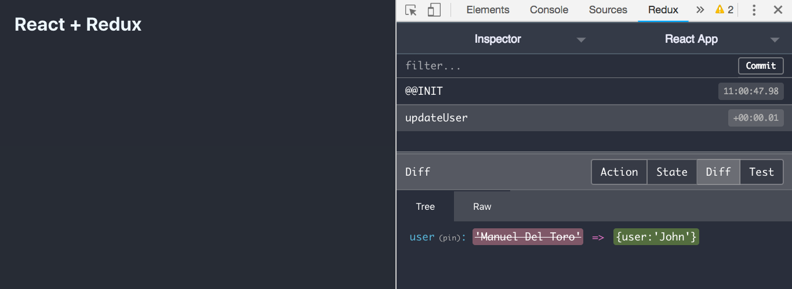

# Redux Overview with React

This Redux overview is based on the tutorial [Redux Tutorial - Learn React/Redux in one video](https://www.youtube.com/watch?v=OSSpVLpuVWA&t=759s)

This documetation is made to understand all the Redux implementation from Scratch using a simple example first and then using more complex and real world problems

## Setting Up Redux

- Install the dependencies

```
yarn add redux react-redux
```

### Example 1 - Basic Implementation

1. **Create the store**

```javascript
import { createStore } from 'redux'

const store = createStore()
```

2. **Create a reducer**

```javascript
function reducer() {
  return 'state'
}
```

3. **Update the createStore() method**

```javascript
const store = createStore(reducer)
```

4. **Print the state of the store**

```javascript
import { createStore } from 'redux'

const store = createStore(reducer)

function reducer() {
  return 'state'
}

console.log(store.getState())
```

#### EXPECTED RESULT


5. **Create an action**

```javascript
const action = {
  type: 'changeState',
  payload: {
    newState: 'newState'
  }
}
```

6. **Create a dispatcher**

```javascript
store.dispatch(action)
```

7. **Modify the reducer**

```javascript
function reducer(state, action) {
  if (action.type === 'changeState') {
    return action.payload.newState
  }

  return 'state'
}
```

8. **Print the state of the store**

```javascript
import { createStore } from 'redux'

const store = createStore(reducer)

function reducer(state, action) {
  if (action.type === 'changeState') {
    return action.payload.newState
  }

  return 'state'
}

console.log(store.getState())

const action = {
  type: 'changeState',
  payload: {
    newState: 'newState'
  }
}

store.dispatch(action)

console.log(store.getState())
```

#### EXPECTED RESULT


### Example 2 - Real World Implementation (Products and Users)

1. **Import combineReducers**

```javascript
import { combineReducers, createStore } from 'redux'
```

2. **Create the products and user reducers**

```javascript
function productsReducers(state = [], action) {
  return state
}

function userReducers(state = '', action) {
  return state
}

const allReducers = combineReducers({
  products: productsReducer,
  users: usersReducer
})
```

3. **Modify the createStore() method**

```javascript
const store = createStore(allReducers)
```

4. **Print the state of the store**

```javascript
import { combineReducers, createStore } from 'redux'

function productsReducer(state = [], action) {
  return state
}

function userReducer(state = '', action) {
  return state
}

const allReducers = combineReducers({
  products: productsReducer,
  user: userReducer
})

const store = createStore(allReducers)

console.log(store.getState())
```

#### EXPECTED RESULT



5. **Set an initial state**

```javascript
const store = createStore(allReducers, {
  products: [{ name: 'MacBook Pro' }],
  user: 'Manuel Del Toro'
})
```

#### EXPECTED RESULT



6. Redux DevTools Extension for Chrome

- Install the [Chrome extension](https://chrome.google.com/webstore/detail/redux-devtools/lmhkpmbekcpmknklioeibfkpmmfibljd?hl=es-419)
- Add this line after the initialState argument in the createStore() method
  ```javascript
  const store = createStore(
    allReducers,
    {
      products: [{ name: 'MacBook Pro' }],
      user: 'Manuel Del Toro'
    },
    window.devToolsExtension && window.devToolsExtension() // <---
  )
  ```

#### EXPECTED RESULT



7. **Create an update user action and dispatch it**

```javascript
const updateUserAction = {
  type: 'updateUser',
  payload: {
    user: 'John'
  }
}

store.dispatch(updateUserAction)
```

8. **Modify the userReducer**

```javascript
function userReducer(state = '', action) {
  switch (action.type) {
    case 'updateUser':
      return action.payload
  }

  return state
}
```

9. **Print the state of the store**

```javascript
import { combineReducers, createStore } from 'redux'

function productsReducer(state = [], action) {
  return state
}

function userReducer(state = '', action) {
  switch (action.type) {
    case 'updateUser':
      return action.payload
  }

  return state
}

const allReducers = combineReducers({
  products: productsReducer,
  user: userReducer
})

const store = createStore(
  allReducers,
  {
    products: [{ name: 'MacBook Pro' }],
    user: 'Manuel Del Toro'
  },
  window.devToolsExtension && window.devToolsExtension()
)

const updateUserAction = {
  type: 'updateUser',
  payload: {
    user: 'John'
  }
}

store.dispatch(updateUserAction)

console.log(store.getState())
```

#### EXPECTED RESULT


