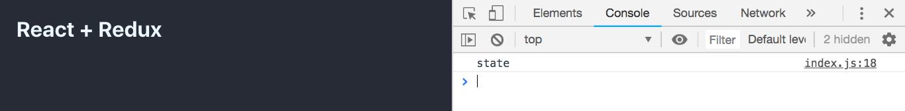
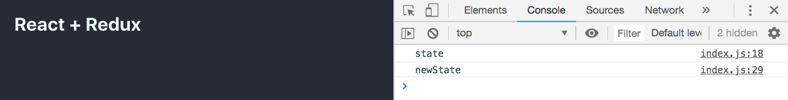

# Redux Overview with React

## Setting Up Redux

- Install the dependencies

```
yarn add redux react-redux
```

### Example 1 - Basic Implementation

1. **Create the store**

```javascript
import { createStore } from 'redux'

const store = createStore()
```

2. **Create a reducer**

```javascript
function reducer() {
  return 'state'
}
```

3. **Update the createStore() method**

```javascript
const store = createStore(reducer)
```

4. **Print the state of the store**

```javascript
import { createStore } from 'redux'

const store = createStore(reducer)

function reducer() {
  return 'state'
}

console.log(store.getState())
```

#### EXPECTED RESULT



5. **Create an action**

```javascript
const action = {
  type: 'changeState',
  payload: {
    newState: 'newState'
  }
}
```

6. **Create a dispatcher**

```javascript
store.dispatch(action)
```

7. **Modify the reducer**

```javascript
function reducer(state, action) {
  if (action.type === 'changeState') {
    return action.payload.newState
  }

  return 'state'
}
```

8. **Print the state of the store**

```javascript
import { createStore } from 'redux'

const store = createStore(reducer)

function reducer(state, action) {
  if (action.type === 'changeState') {
    return action.payload.newState
  }

  return 'state'
}

console.log(store.getState())

const action = {
  type: 'changeState',
  payload: {
    newState: 'newState'
  }
}

store.dispatch(action)

console.log(store.getState())
```

#### EXPECTED RESULT



9. 10. 11. 12.
