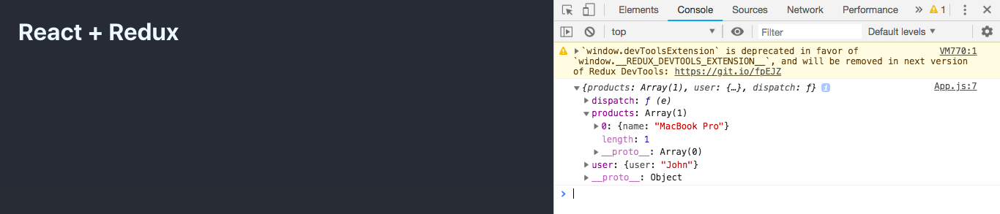
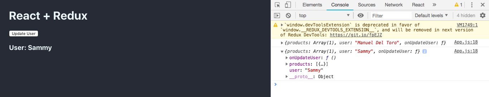

# Redux Overview with React

This Redux overview is based on the tutorial [Redux Tutorial - Learn React/Redux in one video](https://www.youtube.com/watch?v=OSSpVLpuVWA&t=759s)

This documetation is made to understand all the Redux implementation from Scratch using a simple example first and then using more complex and real world problems

## Setting Up Redux

- Install the dependencies

```
yarn add redux react-redux
```

### Example 1 - Basic Implementation

1. **Create the store**

```javascript
import { createStore } from 'redux'

const store = createStore()
```

2. **Create a reducer**

```javascript
function reducer() {
  return 'state'
}
```

3. **Update the createStore() method**

```javascript
const store = createStore(reducer)
```

4. **Print the state of the store**

```javascript
import { createStore } from 'redux'

const store = createStore(reducer)

function reducer() {
  return 'state'
}

console.log(store.getState())
```

#### EXPECTED RESULT


5. **Create an action**

```javascript
const action = {
  type: 'changeState',
  payload: {
    newState: 'newState'
  }
}
```

6. **Create a dispatcher**

```javascript
store.dispatch(action)
```

7. **Modify the reducer**

```javascript
function reducer(state, action) {
  if (action.type === 'changeState') {
    return action.payload.newState
  }

  return 'state'
}
```

8. **Print the state of the store**

```javascript
import { createStore } from 'redux'

const store = createStore(reducer)

function reducer(state, action) {
  if (action.type === 'changeState') {
    return action.payload.newState
  }

  return 'state'
}

console.log(store.getState())

const action = {
  type: 'changeState',
  payload: {
    newState: 'newState'
  }
}

store.dispatch(action)

console.log(store.getState())
```

#### EXPECTED RESULT


### Example 2 - Real World Implementation (Products and Users)

1. **Import combineReducers**

```javascript
import { combineReducers, createStore } from 'redux'
```

2. **Create the products and user reducers**

```javascript
function productsReducers(state = [], action) {
  return state
}

function userReducers(state = '', action) {
  return state
}

const allReducers = combineReducers({
  products: productsReducer,
  users: usersReducer
})
```

3. **Modify the createStore() method**

```javascript
const store = createStore(allReducers)
```

4. **Print the state of the store**

```javascript
import { combineReducers, createStore } from 'redux'

function productsReducer(state = [], action) {
  return state
}

function userReducer(state = '', action) {
  return state
}

const allReducers = combineReducers({
  products: productsReducer,
  user: userReducer
})

const store = createStore(allReducers)

console.log(store.getState())
```

#### EXPECTED RESULT


5. **Set an initial state**

```javascript
const store = createStore(allReducers, {
  products: [{ name: 'MacBook Pro' }],
  user: 'Manuel Del Toro'
})
```

#### EXPECTED RESULT


6. Redux DevTools Extension for Chrome

- Install the [Chrome extension](https://chrome.google.com/webstore/detail/redux-devtools/lmhkpmbekcpmknklioeibfkpmmfibljd?hl=es-419)
- Add this line after the initialState argument in the createStore() method
  ```javascript
  const store = createStore(
    allReducers,
    {
      products: [{ name: 'MacBook Pro' }],
      user: 'Manuel Del Toro'
    },
    window.devToolsExtension && window.devToolsExtension() // <---
  )
  ```

#### EXPECTED RESULT


7. **Create an update user action and dispatch it**

```javascript
const updateUserAction = {
  type: 'updateUser',
  payload: {
    user: 'John'
  }
}

store.dispatch(updateUserAction)
```

8. **Modify the userReducer**

```javascript
function userReducer(state = '', action) {
  switch (action.type) {
    case 'updateUser':
      return action.payload
  }

  return state
}
```

9. **Print the state of the store**

```javascript
import { combineReducers, createStore } from 'redux'

function productsReducer(state = [], action) {
  return state
}

function userReducer(state = '', action) {
  switch (action.type) {
    case 'updateUser':
      return action.payload
  }

  return state
}

const allReducers = combineReducers({
  products: productsReducer,
  user: userReducer
})

const store = createStore(
  allReducers,
  {
    products: [{ name: 'MacBook Pro' }],
    user: 'Manuel Del Toro'
  },
  window.devToolsExtension && window.devToolsExtension()
)

const updateUserAction = {
  type: 'updateUser',
  payload: {
    user: 'John'
  }
}

store.dispatch(updateUserAction)

console.log(store.getState())
```

#### EXPECTED RESULT


10. **Implementing the Provider**

```javascript
import { Provider } from 'react-redux'

ReactDOM.render(
  <Provider store={store}>
    <App />
  </Provider>,
  document.getElementById('root')
)
```

11. **Improving the File Structure**

- Create a folder called /reducers
- Inside of it, create two files.

  - productsReducer.js

  ```javascript
  export default productsReducer(state = [], action) {
    return state
  }
  ```

  - userReducer.js

  ```javascript
  export default userReducer(state = '', action) {
    switch (action.type) {
      case 'updateUser':
        return action.payload
      default:
        return state
    }
  }
  ```

- Fix the imports in the main file

```javascript
import productsReducer from './reducers/productsReducer'
import userReducer from './reducers/userReducer'
```

12. **Connect components to the store - mapStateToProps**

App.js

```javascript
import React, { Component } from 'react'
import { connect } from 'react-redux'

class App extends Component {
  render() {
    console.log(this.props)

    return (
      <div className="App">
        <h1>React + Redux</h1>
      </div>
    )
  }
}

const mapStateToProps = state => {
  return state
}

export default connect(mapStateToProps)(App)
```

#### EXPECTED RESULT



- If you want to be more specific
  App.js

```javascript
import React, { Component } from 'react'
import { connect } from 'react-redux'

class App extends Component {
  render() {
    console.log(this.props)

    return (
      <div className="App">
        <h1>React + Redux</h1>
      </div>
    )
  }
}

const mapStateToProps = state => ({
  products: state.products,
  user: state.user
})

export default connect(mapStateToProps)(App)
```

#### EXPECTED RESULT


13. **Connect components to the store - mapActionsToProps**

- Create a folder called /actions
- Inside of it, create a file.

userActions.js

```javascript
export const UPDATE_USER = 'users:updateUser'

export function updateUser(newUser) {
  return {
    type: UPDATE_USER,
    payload: {
      user: newUser
    }
  }
}
```

- Update the userReducer.js file

userReducer.js

```javascript
import { UDPATE_USER } from './actions/userActions'

export default userReducer(state = '', action) {
  switch (action.type) {
    case UPDATE_USER:
      return action.payload.user
    default:
      return state
  }
}
```

App.js

```javascript
import React, { Component } from 'react'
import { connect } from 'react-redux'
import { updateUser } from './actions/userActions'

class App extends Component {
  constructor(props) {
    this.onUpdateUser = this.onUpdateUser.bind(this)
  }

  onUpdateUser() {
    this.props.onUpdateUser('Sammy')
  }

  render() {
    console.log(this.props)

    return (
      <div className="App">
        <h1>React + Redux</h1>
        <button onClick={this.props.onUpdateUser}>Update User</button>
        <h3>{this.props.user}</h3>
      </div>
    )
  }
}

const mapStateToProps = state => ({
  products: state.products,
  user: state.user
})

const mapActionsToProps = {
  onUpdateUser: updateUser
}

export default connect(
  mapStateToProps,
  mapActionsToProps
)(App)
```

#### EXPECTED RESULT


